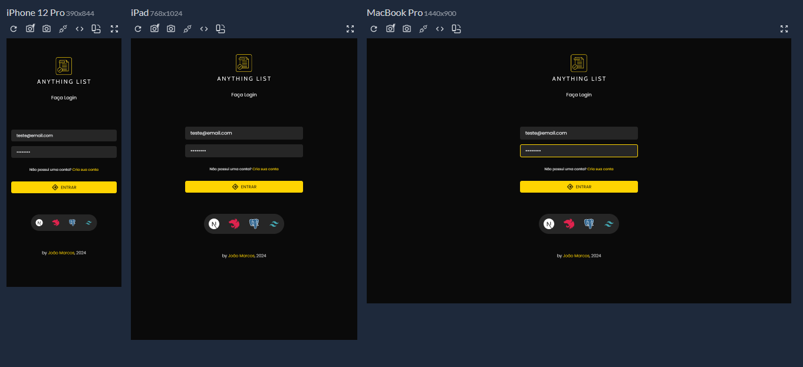

# Anything List

<div align="left">

  
  
  
  
  
  
  
  
  
  
  
</div>

###


<br/>

> Aplicação de listagem de produtos fullstack com frontend usando NEXTJS e TailwindsCSS e backend com NESTJS, banco de dados Postgresql, autenticação com JWT Token e armazenamento de imagens na nuvem com Firebase.

## 🚀 Instalando Anything List

Para instalar o Anything List é necessário ter instalado o banco Postgres e o pgAdmin:


No Windows:

```
git clone https://github.com/Joaommsp/anything-list-fullstack
```

```
cd anything-list-fullstack
```

Acesse o arquivo .env no backend do Projeto e conecte o banco de dados com o pgAdmin já em execução


```js
//.env
DATABASE_URL =
  "postgresql://[nome de usuário]:root@localhost:[porta]/fullstack?schema=public";
```

Instale as dependências

```
npm i
```

Instale o prisma para controlar as migrations do banco de dados

```
npm install @prisma/client@latest @prisma/extension-accelerate
```

Instale o prisma client

```
npx prisma generate
```

No arquivo `prisma.schema` crie as seguintes tabelas :

```js
//prisma.schema
generator client {
  provider = "prisma-client-js"
}

datasource db {
  provider = "postgresql"
  url      = env("DATABASE_URL")
}

model User {
  id       Int       @id @default(autoincrement())
  email    String    @unique
  password String
  produtos Produto[]
}

model Produto {
  id          Int    @id @default(autoincrement())
  name        String
  price       Float
  description String
  imageUrl    String
  userId      Int
  user        User   @relation(fields: [userId], references: [id])
}
```

Crie uma migration

```
npx prisma migrate dev --name init
```

Rode a API

```
npm run dev
```

Acesse o frontend do projeto e instale as dependências

```
npm i
```

Crie um projeto no firebase e crie um banco `storage` e crie uma pasta nomeada de `products-images`


Configure o arquivo do firebase em `src/services/firebase-service.js`

```js
import { initializeApp } from "firebase/app";
import { getStorage } from "firebase/storage";

const firebaseConfig = {
  apiKey: "",
  authDomain: "",
  databaseURL: "",
  projectId: "",
  storageBucket: "",
  messagingSenderId: "",
  appId: "",
};

const app = initializeApp(firebaseConfig);
const storage = getStorage(app);

export { storage };
```

Execute o projeto

```
npm run dev
```

## 💻 Um pouco do projeto


## 📱 Responsividade




## 🤓 Me acompanhe para mais projetos
